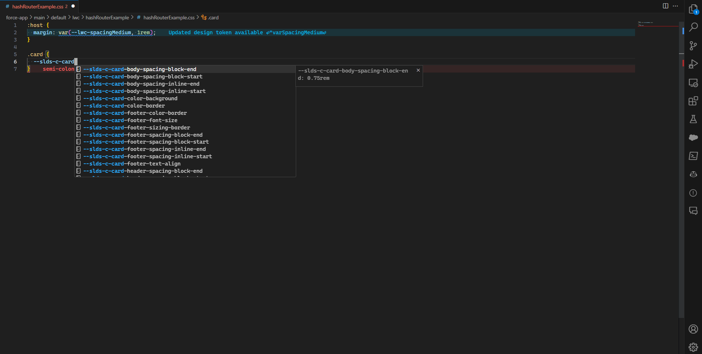

# Lightning Web Components Styling Hooks

The Lightning Web Components Styling Hooks lets you use all the styling hooks available for standard lightning web components. You do not need to visit [https://lightningdesignsystem.com](https://lightningdesignsystem.com) and search through the blueprint anymore.

## Features

Provides code completion for styling hooks available for standard lightning web components. I will be keeping it up to date with each Salesforce release.

- Type `--slds` to see all the available styling hooks
- keep typing to find a matching styling hook if it exists

  

## Requirements

- Lightning Web Components Styling Hooks are specific to Salesforce. Please make sure you are using them in a Salesforce project only, even though the extension is available outside of a Salesforce project.
- Currently it supports `css` files only.
- Please make sure you are using the latest version of VS Code. At the time of building this extension, I was on version 1.81.0

## Known Issues

If you see any issues, please report [here](https://github.com/ashis-kumar-dev/lightning-web-components-styling-hooks/issues)

## Feature Requests

You can also request for new features [here](https://github.com/ashis-kumar-dev/lightning-web-components-styling-hooks/issues)

## Credits

- logo generated by Dall-E with help of Bing, Microsoft Designer

## Release Notes

### 0.0.1

Initial release of Lightning Web Components Styling Hooks provider
